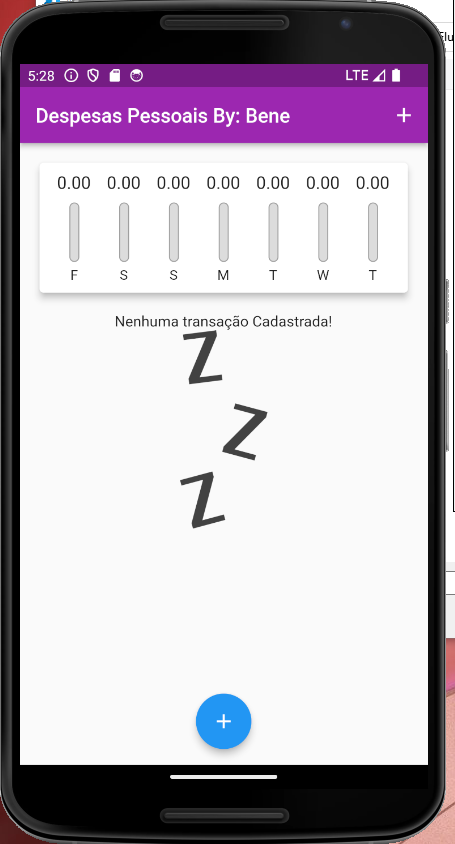

# Aplicativo "Expenses"

## Visão Geral

O aplicativo "Expenses" é uma ferramenta simples e eficaz para o controle das suas despesas diárias. Com este aplicativo, você pode facilmente registrar suas despesas e monitorar seus gastos de forma organizada. Além disso, o aplicativo permite excluir despesas que você não deseja mais manter no registro.

## Funcionalidades

O aplicativo "Expenses" oferece as seguintes funcionalidades:

1. **Registro de Despesas**: Adicione despesas diárias de forma rápida e fácil, com informações como data, valor e descrição.
2. **Lista de Despesas**: Visualize suas despesas registradas em uma lista organizada, exibindo as informações essenciais.
3. **Exclusão de Despesas**: A capacidade de excluir despesas antigas ou indesejadas do registro.
4. **Totalização de Gastos**: Acompanhe o total gasto durante um período selecionado, como o mês atual ou a última semana.
5. **Gráficos e Estatísticas**: Visualize gráficos e estatísticas que fornecem insights sobre seus padrões de gastos.
6. **Categorias de Despesas**: Categorize suas despesas para uma organização mais eficiente.
7. **Pesquisa de Despesas**: Pesquise rapidamente despesas específicas com base em palavras-chave ou datas.

## Screenshots

*Tela principal com lista de despesas*

*Adicionar nova despesa*

## Como Usar

1. Baixe e instale o aplicativo "Expenses" no seu dispositivo Android ou iOS a partir da loja de aplicativos correspondente.
2. Ao abrir o aplicativo, você verá a tela principal listando todas as despesas registradas.
3. Toque no botão de adicionar (+) para inserir uma nova despesa.
4. Preencha os campos obrigatórios, como data, valor e descrição.
5. Se desejar, adicione uma categoria à despesa.
6. Toque em "Salvar" para registrar a despesa.
7. Para excluir uma despesa, deslize para a esquerda na despesa desejada e selecione "Excluir".
8. Use as opções de pesquisa, gráficos e estatísticas para uma análise mais aprofundada dos seus gastos.

## Requisitos

- Dispositivo Android ou iOS.

## Contribuição

Se você deseja contribuir para o desenvolvimento do aplicativo "Expenses", fique à vontade para criar um fork do repositório no GitHub e enviar suas solicitações de pull. Estamos abertos a melhorias e novas funcionalidades!

[Repositório no GitHub](https://github.com/seu-usuario/expenses-app)

## Contato

Se você tiver alguma dúvida, sugestão ou precisar de suporte, entre em contato conosco em [contato@expensesapp.com](mailto: benevaniosantos930@gmail.com).

Obrigado por escolher o aplicativo "Expenses" para o controle eficiente das suas despesas diárias!
